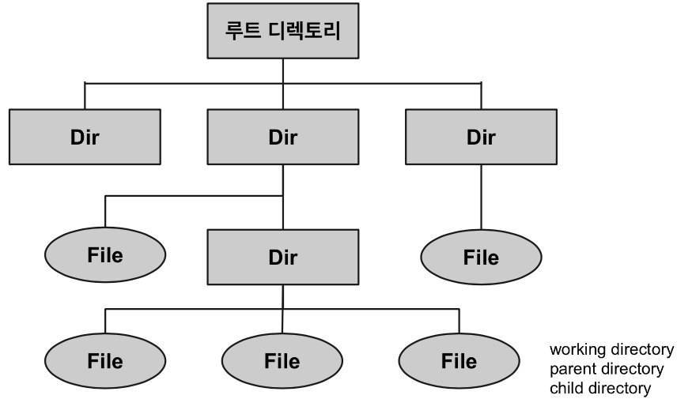

# Folder and Directory

## Folder **(folder, 탐색기 위주)**

- 윈도우 등의 GUI 환경에서 ^^여러가지 종류의 파일을 저장하고 있는 곳^^.
    - 마치 현실세계의 서류를 논리적으로 묶어 서류철을 만들고 놓는 장소를 구분해놓는 것과 비슷.
- 원래 여러 장의 서류를 합쳐서 보관하기 위한 접을 수 있는 커버를 가르킴.

> 파일들을 분류하여 비슷한 카테고리별로 나누어 담아 놓은 장소

## Directory **(terminal or cmd 위주)**

- 도스나 리눅스 등에서 여러가지 종류의 파일을 저장하고 있는 곳.

<figure markdown>    
{width="500"}
</figure>
    

> Folder와 거의 비슷.  
> 쉽게 생각해서 ^^directory는 CLI(command line interface)기반에서 주로 사용되던 용어^^ 라고 봐도 된다.

## Folder vs. Directory

* 거의 비슷하지만, 윈도우 환경에서의 네트워크 환경 같은 folder는 ***특수 폴더*** 로 `cmd` 등에서 보이지 않음. 
* 폴더가 디렉토리보다 보다 더 큰 개념이라고 볼 수 있음.