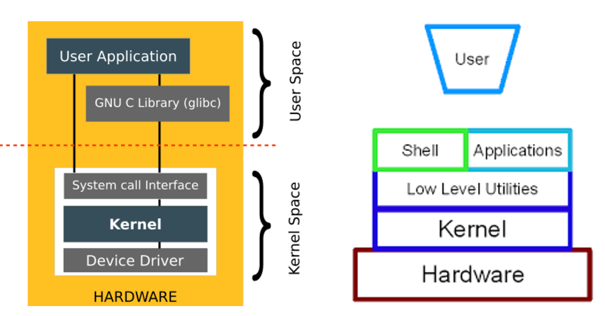
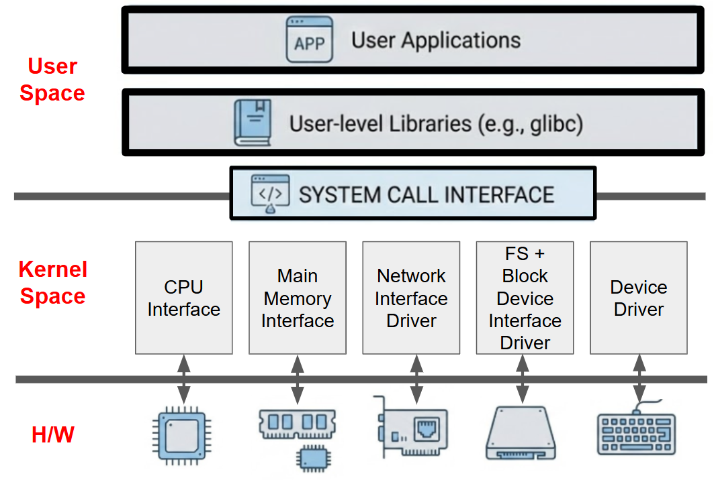

# Kernel

운영체제 중 항상 메모리에 올라가 있는 **운영체제의 핵심 부분**

* `H/W(하드웨어)`와 `User program` (or application, app) 사이에서 
* `User program` (or application) 수행에 필요한 여러 ^^서비스를 제공하기 위한 **인터페이스를 제공**^^
* **컴퓨터 H/W (CPU, Memory)의 resource(자원)들을 관리**

좀 더 간략한 요약자료는 다음을 참고:[Kernel이란?](https://ds31x.tistory.com/131#%EC%B0%B8%EA%B3%A0-kernel%EC%9D%B4%EB%9E%80?)

다음 그림은 Linux Architecture로 Kernel이 OS에서 어디에 위치하는지를 보여준다.

> The kernel is ^^the core of an operating system^^ that  
> 
> * manages system resources and 
> * provides services to applications and user processes.  
>
> It is responsible for ^^managing the computer's memory, input/output operations, and scheduling of processes^^.  
> 
> The kernel also serves as a ^^bridge between the hardware and software components^^ of the computer system. 
>
> Without the kernel, the computer system would not be able to function properly.

---

## 컴퓨터 H/W resource에 대한 interface 제공.

Kernel은 ***User program과 H/W resource 사이에서 이들을 연결*** 해주는 역할을 수행함.

* User program은 `system call`을 통해 kernel에 필요한 H/W resource의 사용을 요청하며, 
* Kernel은 이를 받아 해당 `H/W resource`에게 해당하는 명령을 전달하여 작업을 수행하고, 그 결과를 `system call`을 통해 user program에 반환해줌.

{style="display:block; margin: 0 auto; width:500px"}

> User program은 ***Kernel이 제공하는 `system call interface`을 통해 computer의 physical resource를 사용*** 하게 됨.

* Linux가 제공하는 `System call`은 CPU architecture에 따라 다르지만 대략 300개 이상임.
* User programs와 Kernel 의 대화는 `system call`이라는 단일 인터페이스가 제공되는 것과 달리,
    * `C`프로그래머의 경우 직접적으로 `system call`을 호출하지 않고, `C Standard Library`를 통해 우회적으로 호출함.
    * `C Standard Library`는 `System call`에 대한 ***Wrapper*** 기능을 제공하며 `glibc`나 `musl` 과 같은 다양한 implementation을 가짐. 
* H/W와 Kernel간의 interface는 일반적으로 다음과 같은 <u>H/W별로 그룹화된 **개별 interface** 들의 모음</u> 으로 구성됨.
    * ***CPU Interface*** : Task Management 에 대응
    * ***Main Memory Interface*** : Memory Management에 대응
    * ***File System and Block Device Interface (and Driver)*** : File System Management에 대응
    * ***Network Interface (and Driver)*** : Network Management에 대응
    * ***Device Driver Interface*** (=키보드, 터미널, H/W interrupts 등) : Device Driver Management, Interrupt Handling 등에 대응

---

## H/W Resource Management

Kernel은 컴퓨터 HW의 physical resource를 관리하며, 이들의 `abstraction` (or virtualization)인 `virtual resource`를 생성 및 관리함.

> Kernel은 이같은 `abstraction`을 통해 다른 vender들의 다양한 H/W들의 차이에 상관없이 User (User program포함)가 H/W를 사용할 수 있게 해준다.  
> Kernel이 노출하고 있는 `System call`만을 알고 있다면, H/W를 직접 제어할 필요가 없으며, 이를 통해 S/W의 portability(이식성)가 향상된다.

**`virtual resource`는 physical resource를 abstraction(추상화)한 것** 으로 각각의 User program들에서는 해당 virtual resource가 보이며, 이를 통해 user program들은 현재 자신이 특정 HW를 혼자서 쓰는 것처럼 느끼게 됨.

| Physical H/W | Virtual H/W |
| --- | --- |
| CPU | Task or Processor |
| Memory (or RAM) | Page or Segment |
| Disk (or HDD, SSD) | File |
| Network | Socket |

> User space에서는 Kernel에 의해 보다 abstraction이 많이된 resource에 접근하기 때문에 상대적으로 속도가 느리지만 보다 안전하고 편리한 기능을 사용가능함.  
> Kernel은 abstraction이 제한된 H/W에 직접적으로 접근함으로서 보다 빠른 속도로 접근가능함.  
> 대부분의 개발자들은 User space에서만 동작하는 S/W를 만들기 때문에 Kernel mode에 대해 자세히 알 필요는 없으나 ***`System call`을 통해 Kernel과 상호작용하는 방식*** 에 대해선 이해하고 있는 것이 좋다. 

Kernel이 수행하는 H/W resource관리는 다음과 같음.

`Task(Process) Management` 
: Physical resource인 CPU를 추상적 자원인 Task (or Processor)로 제공

`Memory Management` 
: Physical resource인 메모리를 추상적 자원인 Page (or Segment)로 제공

`File System` 
: Physical resource인 디스크를 추상적 자원인 File로 제공

`Network Management` 
: Physical resource인 네트워크 장치를 추상적 자원인 Socket으로 제공

`Device Driver Management` 
: 기타 외부 Device들 (Peripheral devices)과 user program 사이에서 중재자/인터프리터 로서 동작하면서 해당 Device들의 driver들을 관리함.

`Interrupt Handling` 
: 인터럽트 핸들러

`I/O Communication`
: 입출력 통신 관리

---

## OS에서의 역할.

- OS는 `kernel`에 `system program (shell 및 여러 s/w)`들이 더해져서 구성된다.
- 추가되는 system program들은 file system utility, windowing systems 등등으로 User 또는 User program들이 컴퓨터를 보다 편리하게 사용할 수 있도록 해줌.
- 사실 kernel은 컴퓨터 사용자와 직접적으로 interaction은 하지 않고, ***shell이 중간에 위치하여 이를 담당함*** .

> kernel은 shell을 통하거나 다른 User program (or Application)을 통해 사용자와 interaction을 수행함.
>
