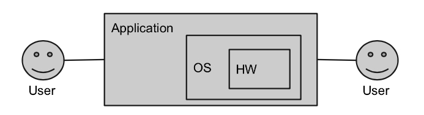

# Operating System (운영체제)

* 다음 URL을 꼭 읽어볼 것: [OS란?](https://dsaint31.tistory.com/219)

오케스트라의 지휘자처럼, ^^컴퓨터 시스템을 구성하고 있는 여러가지 자원(resource)^^ 에게 어떤 동작을 하도록 **지시하고 관리하는 역할** 을 하는 ***프로그램들의 집합***.

사용자 측면에서 ***컴퓨터의 하드웨어에 대한 지식 없이도 컴퓨터시스템을 쉽게 사용 가능*** 케 해주고 시스템 측면에선 ***컴퓨터 시스템의 성능을 최대 한도로 향상*** 시키는 프로그램.

- 컴퓨터의 하드웨어 ***관리***
- 응용프로그램들(Application, App)의 토대를 제공해주는 프로그램
- "사용자, 응용프로그램들"과 "하드웨어" 사이의 중간 매개체 역할.

> 간략하게 말하면,  
> OS의 주요기능은  
> 
> * 컴퓨터의 다양한 H/W를 abstraction(virtual resource로 추상화: [Kernel참고](./kernel.md#hw-resource-management))하고,
> * 이들을 사용자 및 응용프로그램들이 접근가능하도록 [API](https://dsaint31.tistory.com/503)를 제공하는 것(사실 Kernel이 이를 담당)임.  
> * 이 API를 이용하는 programming으로 다양한 응용프로그램(Application or App)이 컴퓨터에서 추상화된 H/W를 사용할 수 있음.
> 
> 참고로, OS가 제공해야하는 서비스를 위한 표준 API로 가장 유명한 표준안은 [POSIX](../CE/ch15/ce15_2_4_portability.md#portable-operating-system-interface-posix)임.

---

## OS의 목적

- **운영체제는 User Interface(사용자 인터페이스)를 제공 → 사용자가 컴퓨터의 H/W 지식 없이도 편리하게 시스템 사용케 함.**
- **컴퓨터 시스템의 자원들을 효율적인 운영 (자원 스케쥴링 등등)**

---

## OS가 제공하는 Services

1. **프로그램의 실행** : 사용자가 원하는 프로그램을 실행시킴.
2. **입력/출력 동작 지원** : 사용자 프로그램이 데이터의 I/O를 수행할 수 있게 지원.
3. **파일 시스템 조작** : 파일의 생성, 삭제 등의 파일 관리에 대한 기능을 제공.
4. **자원 관리 및 할당** : 여러 사용자 혹은 프로세스가 제한된 자원을 사용하려고 할 때, 효율적으로 해당 자원 할당을 수행.
5. **계정 관리** : 사용자들의 컴퓨터에 관한 기록을 저장하고, 이를 처리하여 자원의 활용 상태 파악등에 이용.
6. **오류 탐지** : 항상 가능한 한 모든 오류의 상태를 탐지.
7. **보호** : 사용자 정보를 보호할 수 있는 체제를 제공.

---

## OS의 종류

### 여러 OS들

* [Windows](./windows.md) **
* [LINUX](./LINUX.md) **
* [UNIX](./UNIX.md)
* mac OS **

---

### 운영기법에 의한 종류

#### 일괄 처리 (Batch Processing) 시스템

1. 한번에 하나의 프로그램(=[process](https://ds31x.tistory.com/152)) 만이 수행 된다.
2. 운영체제는 항상 **메모리(=RAM)** 에 상주한다: [stored program computer](../CE/ch05/ch05_01_01.md)
3. 처리 속도를 향상시키기 위해 유사한 요구를 필요로 하는 작업을 ***일괄처리*** 하였다.
4. 시대적으로 가장 먼저 생겨난 형태이다.
5. 단점 : 기계적 입출력 장치가 전자적 장치의 속도보다 상대적으로 느려 CPU가 쉬는 경우가 많았다.

---

#### 다중 프로그래밍(Multi-programming) 시스템

CPU (당시엔 거의 core가 하나)의 idle time을 줄이기 위한 시스템.

1. 여러 개의 프로그램(=[process](https://ds31x.tistory.com/152))을 동시에 메모리(=RAM)에 적재하고 
2. 그 중 하나의 프로그램이 수행하다가 I/O, 인터럽트 등에 의해 대기 상태가 되면 그 동안 다른 프로그램을 실행하는 방식이다.
3. ***입출력과 프로그램의 실행을 병렬*** 로 할 수 있어, CPU 사용 효율이 증가한다.
4. context changing 에 초점을 둔 시스템이라고 봐도 될 듯.

---

#### 시분할 (Time sharing) 시스템

1. 다중 프로그래밍 시스템은 사용자와의 ***상호작용*** 을 제공하지 못 하였기 때문에, 등장한 시스템
2. 다중 프로그래밍과 달리 ^^정해진 시간이 되면 무조건 다음 순서의 작업을 실행^^ 하는 방식
3. 작업 교대 시간이 매우 짧아 프로그램이 실행되는 동안 사용자는 컴퓨터와 상호작용을 함
4. 가상 메모리를 사용하여, 많은 메모리를 사용 할 수 있다.

---

#### Multi-tasking System ***

1. 하나의 resource (=일반적으로 CPU)를 여러 process들이 공유
2. 여러 ***tasks가 동시에 수행 되는 것처럼 느껴지게 (=concurrency) 하는 시스템***
   * round-robin scheduling algorithm과 같은 ***스케쥴링 알고리즘*** 이 multi-programming에 추가되어 multi-tasking 이 된다.
   * 용어적 측면에서 ***`concurrency`(동시성)*** 을 갖춘 시스템이 바로 multi-tasking system임.
3. multi-programming의 논리적인 확장
4. multi-programming에 time-sharing 의 개념이 보다 추가된 것으로 볼 수 있음.

> **Task란** : 매우 중요함!
>
> OS에서 실행되는 Program의 instance를 가르키는 ***Process*** 와 비교할 때,  
> <u>***Task*** 는 보다 일반적인 용어</u>임.  
>
> ***Task는 특정 목표를 달성하기 위해 수행되는 작업이나 활동을 의미*** 하며,  
> 컴퓨터에서 Task는 보통 하나 이상의 Process로 구성됨.
> Task는 특정 작업을 완료하는데 필요한 모든 단계를 포함하는 것이 일반적임.
>
> * Process는 OS가 관리하는 단위임.
> * 보통 Task는 OS의 관리 단위가 아님.

---

#### 다중 처리 (Multi-processing) 시스템 ***

1. ***여러 개의 CPU*** 와 한 개의 주기억 장치로 여러 프로그램을 동시에 처리하는 시스템.
2. 여러 process가 동시에 수행됨 (core수 만큼).

multi-tasking인 `concurrency`를 구현한 것이라면,  
multi-processing은 `parallelism`을 구현한 것임.

* **참고:** 다음 URL을 읽어볼 것: [Concurrency vs. Parallelism](https://ds31x.tistory.com/304)

---

#### 실시간 처리 (Real Time) 시스템

1. 프로세서 작동이나 데이터 흐름에 ***엄격한 (처리 혹은 응답)시간 제약*** 이 있을 때 사용.
2. 발생 data를 곧바로 바로 처리.
3. 실시간 시스템의 운영체제는 보통 특수 목적용이다.  
   ex) 기차표 예약 업무, 은행 업무

---

#### 다중 모드 시스템
    
일괄 처리 시스템 + 시분할 시스템 + 다중 처리 시스템 + 실시간 처리 시스템

---

#### 분산 처리 시스템

1. 네트워크를 통해 통신하여 그 기능을 제공
2. 여러 프로세서를 사용하지만, 밀결합(tightly-coupled) 구조가 아닌 ***소결합(loosely-coupled)*** 형태
3. 컴퓨터 버스나 클럭을 공유하지 않고, 네트워크를 이용해 통신

[`Grid Computing System`](../CE/ch04/ce04_53_grid_system.md) 이 대표적인 ***분산처리 시스템*** 이다.