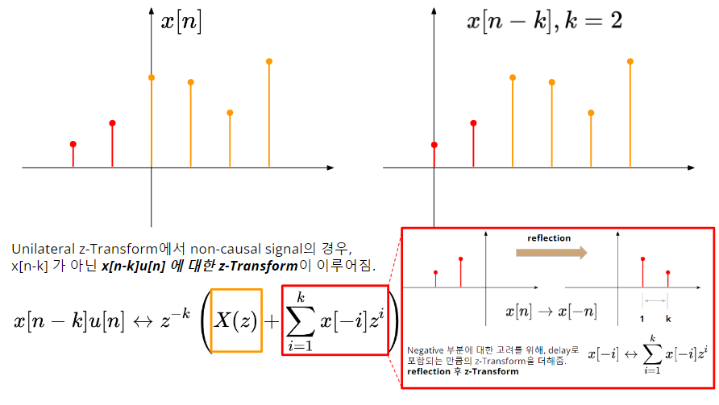
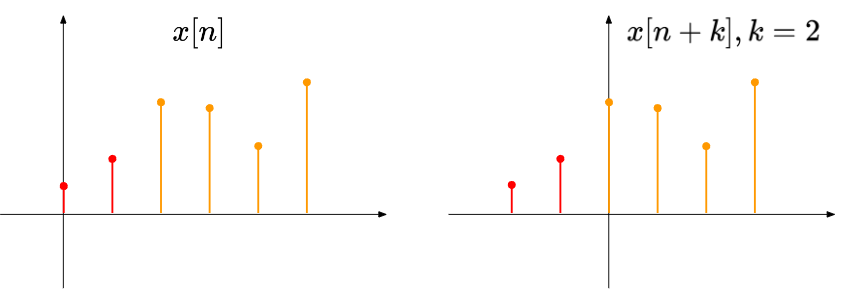

# Time Shift : Properties of z-Transform

## Bilateral z-Transform의 경우 

$k$만큼의 `delay`가 된 signal $x[n-k]$에 대한 z-Transform은 다음과 같음.

$$
x[n-k] \leftrightarrow z^{-k}X(z)
$$

증명은 다음과 같음.

$$
\begin{aligned}x[n-k] \leftrightarrow \sum^\infty_{n=-\infty}x[n-k]z^{-n}&=\sum^\infty_{m=-\infty}x[m]z^{-m-k}\\&=z^{-k}\sum^\infty_{m=-\infty}x[m]z^{-m}\\&=z^{-k}X(z)\end{aligned}
$$

time domain에서의 `dealy`는 frequency domain에서의 `linear phase shift`에 해당.

- time delay와 phase shift의 관계를 나타냄.
- $z=re^{j\omega}$ 이므로 phase response는 $-k\omega$로 $\omega$에 대해 선형임.

$k$만큼의 지연을 시키는 Delay device 의 transfer function은 $z^{-k}$임.

- time signal을 $k$ 만큼 delay 시키는 동작은 z-Transform에서 $z^{-k}$를 곱하는 것임.
- 1만큼의 지연을 시키는 Delay device 표시가 $z^{-1}$ 인 이유임.

Bilateral의 경우, `delay` ($k>0$)와 `advance` ($k<0$) 모두 위의 식을 만족하지만, 우리가 일반적으로 쓰는 z-Transform은 unilateral이다. (causal system을 주로 사용하는 등의 이유로 인해..)

> 문제는 unilateral에서는 `delay`와 `advance`에 대한 z-Transform이 같지 않다.

---

## Delay for Unilateral z-Transform

우선 $k>0$인 `delay`가 non-causal signal에서 발생할 경우, 기존에 무시되었던 negative region에 있던 값들을 고려해야 한다.

아래 그림은 $k=2$인 `delay`가 non-causal signal에서 발생한 경우를 보여준다. 붉은 색의 값들은 기존의 unilateral에서는 고려되지 않았으나, `delay` 이후에는 고려가 되어야 한다.

위 그림의 아래에 이를 고려한 unilateral z-Transform이 나타나 있다. 빨간 색의 박스로 표기된 부분이 차이점이며, 이는 difference equation으로 주어지는 discrete LTI system 분석에서 initial condition 처리와 관련된다.

$$
\displaystyle x[n-k]u[n] \leftrightarrow z^{-k}\left(X(z) + \sum^k_{i=1}x[-i]z^{i}\right)
$$

* $u[n]$은 unit-step function으로 unilaterl z-transform에서 0이상인 부분만을 고려함을 나타냄.

---

### Advance for Unilateral z-Transform

$k<0$인 `advance`가 signal에서 발생할 경우, `advance`로 인해 negative region으로 이동한 값들을 더이상 고려해선 안된다.

다음 그림은 이를 간략히 보여준다.

Unilateral z-Transform에서는 $x[n+k]$ 가 아닌 $x[n+k]u[n]$ 에 대한 z-Transform이 이루어지므로, negative영역이 되어 없어지는 부분을 빼주는 처리가 필요함

이를 수식으로 나타내면 다음과 같음.

$$
\displaystyle x[n+k]u[n] \leftrightarrow z^{k}\left(X(z) - \sum^{k-1}_{i=0}x[-i]z^{i}\right)
$$
