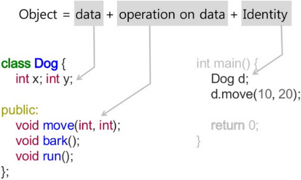

# Abstraction (추상화) : Class and Instance

> 抽 : 뽑아낼 추  
> 像 : 모양 상  
>  
> Abstraction(추상화) = 어떤 대상으로부터 모양(feature) 을 뽑아내는 것

Abstraction의 의미는 다음과 같음.

- 내부의 복잡한 사실을 숨겨서, 이해 및 사용하기 쉽도록 단순화한 것
- **문제 해결** 하는데 있어 **중요하고 필수적인 사항** 만을 다루도록 **단순화시키는 것** 을 **abstraction(추상화)** 라 함.
- 필수적이고 중요한 이미지나 관념 (=feature) 만을 표현

Abstraction의 관점에서 그 결과물인 `model` 이란 세상의 실제적인 것이 ***현재 주어진 문제를 풀기위해 단순화된 것*** 이라고 볼 수 있음.

- 필요한 특징(feature)만을 뽑아낸 것.
- feature는 상태값과 동작으로 나뉘며, 이는 attribute(or field, variable)와 behavior(or method, function)이라 불림.

비슷하게 modeling은 model을 생성하는 과정이며, 즉 abstraction과 비슷한 의미로 사용될 수 있음.

단, OOP에서는 `model`이라는 용어보다 `Class` 를 보다 많이 사용함.

> 어떤 대상 → Class 로 정의하는 것이 OOP에서의 abstraction이 됨.

---

## OOP에서의 Class란?

- `표현 대상` 에 대한 abstraction의 결과물.
- `표현 대상` 의 abstraction 표현
- `표현 대상` 의 feature(특징) 에 대한 description.
- `표현 대상` 에 대한 필요한 특징을 서술한 것.

> 실제로 Python에서는 class를 정의하는 `class` 키워드를 통해 새로운 type을 정의한다.

---

## Class vs. Instance

- Class가 *실체화* 된 것. ← 프로그래밍에서 실체화란 메모리를 점유하고 사용가능해진 상태를 의미.
- OOP에서는 **메모리에 하나의 변수(←class를 가르키는)로 생성된 것** 을 가르킴.
    - Class는 일종의 Type(타입) / Instance는 해당 Type의 변수
    - 한 Class에 대해 여러 Instance가 존재할 수 있음.
- **좁은 뜻의 Object** 의 경우, 이 instance를 가르키기도 함.
    - Object = Instance of Class

> Instance는 Class가 실체(instance) 로 만들어진 것.  
>
> * class = concept = type
> * object = instance = variable

많이 사용되는 예는 붕어빵틀과 붕어빵이다. 여기서 class는 붕어빵틀이고, instance는 붕어빵이라고 볼 수 있다.

---

## Attribute and Behavior

일반적으로 OOP에서 Abstraction은

* 대상이 되는 **Object 의 feature(특징)** 을
    * Data와 
    * Operation 
* 로 만들어내는 것임.

일반적으로 이 Data와 Operation을 가르키는 용어는 다음과 같음.

**attribute**  
: = data = **member variable** = state = field

**behavior**  
: = operation = member function = **method**

일반적으로 이렇게 사용되지만, 분야에 따라 조금씩 차이가 있으므로 주의해야한다. 참고로 Python에서는 `attribute`라는 용어로 ^^C++에서의 `member variable` 개념과 `method` 개념^^ 을 합쳐서 표현하는 경향이 있다.  
`member variable`과 `member function`은 C++에서 많이 사용되며, Java에서는 `member variable`과 `method`가 많이 이용된다.

---

## Summary

OOP에서 Abstraction은 대상이 되는 **Object 의 feature(특징)** 을 Data와 Operation 로 만들어내는 것을 가르킨다.

“머리카락”이 대상이 되는 Object

* Data : Attribute = 머리카락 색
* Operation : Behavior, Method = 자르기

OOP에서 넓은 범위의 Object는 모든 것(현실 세계와 프로그래밍 세계 포함)을 가르키며, **Object의 특징** 은 abstraction을 통해 Class로 기술되며,Class는 Attribute와 Method로 구성되게 된다.

---

다음은 C++의 관점에서 Object(우리 문서에서는 instance)와 abstraction을 잘 보여주는 그림이라 첨부합니다.  
(출처가 기억이 안 납니다. ㅠㅠ)



* `Dog` class는 member variable로 `x`와 `y`를 가짐.
* 이들에 대한 method가 공개되었고, setter와 getter로 동작함.
* `Dog`의 instance가 `main`함수에서 생성되었고, method `move()`를 통해 member variable들의 값을 변경하고 있다.
* 각 instance는 identity로 변수명을 가지며, 위의 예에서는 `d`를 가짐.

---

Python에서 class의 member variable (or instance variable)은 조금 독특하다. Python의 특성상 assignment에서 변수 생성이 이루어지는 터라, C++처럼 미리 정의해두는 게 아닌, 실제로 값을 할당할 때, 만들어지는 특성을 가진다. 

```python
class Samp:
    def get_x(self):
        return self.x
if __name__ == "__main__":
    s = Samp()
    s.x = 23 #주석처리시 에러.
    print(s.get_x())
```

위의 코드에서 `self.x` 는 Class `Samp`의 instance가 가지는 attribute이지만, getter만이 정의가 되어있다. `s.x = 23` 의 assignment가 getter보다 먼저 이루어지지 않으면 에러가 난다. (처음 python을 봤을 때 이게 뭐지 라고 생각한 것 중 하나임.)  

이는 동적으로 class에 attribute 추가가 가능(dynamic language라는 특성 활용이라고 봐야할지...)하다는 애기이다. class에 method도 동적으로 추가가 가능한 flexibility를 python은 제공한다. (개인적으로 선호하는 방식은 아니다). 

때문에 가급적 생성자 `__init__`에서 사용할 member variable에 해당하는 variable들을 초기할당이라도 해두는게 좋다. Java나 C++을 먼저 익힌 경우에는 당연한 애기인데... python부터 배운 분들의 코드를 보면 순간적으로 당황할 때가 있다(오류는 아니지만, 호출 순서가 달라지면 에러가 뜨기 쉬움.)