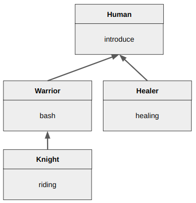
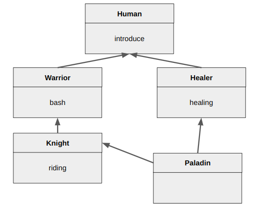

# Inheritance (상속)

OOP에서 애용되는 Object간의 관계(relation) 중의 하나이다. Inheritance를 통해 생성되는 관계가 `is-a`관계 (이후 다룸)임.

Hierarchy(계층화)와 함께 modularity (모듈화)와 코드의 재사용성을 극대화 시킬 수 있는 방법임.

> Hierarchy(계층화) 를 다시 한번 읽어볼 것.
>

## Class의 Hierarchy 구조

Class에서의 Hierarchy는 inheritance를 통해 이루어진다. 다음은 판타지 게임의 인간 종족을 abstraction하고 이들을 상속을 통해 계층화 한 Diagram이다.



inheritance를 통해

- 기존 class와 구분되는 ***특징*** 만을 기술하여
- **subclass(하위 class)** 로 추가.

상속에 따라 attribute(특성)을 공유하게 됨. ← 재사용성이 높아짐.

* attributes는 Python의 용어로서 class가 가지고 있는 methods와 variables를 가르킴.

> Python이나 Java는 모든 class에서 가져야할 attributes를 Object 라는 클래스에 구현하고 이를 상속받는 구조를 취함으로서 재사용성을 극대화하고 구현코드를 최소화함.

용어들은 다음과 같음.

* parent class = super class = 상위클래스
* child class = sub class = 하위클래스

### Example (Python)

```python
class Human:
    def __init__(self, name):
        Human.ds_type = "Human"
        self.job = None
        self.name = name
        
    def introduce(self):
        print("------------------------")
        print(f"제 이름은 {self.name}입니다.")
        print(f"제 직업은 {self.job}입니다.")
        print(f"저의 종족은 {Human.ds_type}입니다.")
        
class Warrior (Human):

    def __init__(self, name):
        super().__init__(name)
        self.job = "Warrior"

    def bash (self):
        print("강타 능력")

class Knight(Warrior):
    def __init__(self, name):
        super().__init__(name)
        self.job = "knight"
    def riding (self):
        print("말타기 능력")

class Healer (Human):
    def __init__(self, name):
        super().__init__(name)
        self.job = "Healer"

    def healing (self):
        print("치료하기 능력")

if __name__ == "__main__":
    ins0 = Human("김 아무개")
    ins1 = Warrior("이 아무개")
    ins2 = Healer("박 아무개")
    ins3 = Knight("박 기사")

    humans = [ins0, ins1, ins2, ins3]
    for h in humans:
        h.introduce()    
```

* 생성자 `__init__(self, name)`를 모든 sub-class에서 over-riding하고 있음.
* over-riding할 경우, super-class의 method는 가려져서 대체된다. 때문에 super-class의 것을 호출하기 위해선, `super()`를 통해 super-class의 object를 가져와서 호출해야함. 
* `super().__init__(name)`을 통해 super-class의 생성자를 호출하고 나서 sub-class 고유의 처리구문을 수행함.
* over-riding을 하지 않는 경우, 기본적으로 super-class의 method를 사용한다. 위의 `Human` 의 `introduce`메서드가 그 예임.
    * 즉, 공통적으로 사용되는 attributes들은 super class에 구현하는게 좋다.

> over-riding과 over-loading은 다른 개념임. 그 차이점을 숙지하고 있어야 한다. 자세한 건 다음 url을 참고하라.  
> [overriding and overloading](https://ds31x.tistory.com/36)

## Multiple Inheritance (다중 상속)

두 개 이상의 super class가 필요한 경우 사용된다. Java와 같이 super class는 하나만을 허용하고, interface등을 통해 Multiple Inheritance의 기능을 구현하는 경우도 있다. 실제로 Multiple Inheritance는 편리하지만, 그만큼 ***충돌이 발생할 위험이 크다*** 는 부작용도 있다 (같은 이름의 method가 여러 super class에 존재시 어느 super class의 메서드를 우선시할지 등등).



* multiple inheritance가 발생하면 다이아몬드 모양이 만들어진다고 해서 `다이아몬드 상속`이라고 부르기도 한다.

Python에서는 다중상속을 지원하고 Method Resolution Order (`mro()`로 확인 가능)에 따라, 왼쪽에 놓인 super class에서부터 우선권이 주어진다.

### Example (Python)

```python
...

class Paladin (Knight, Healer):
    def __init__(self, name):
        super().__init__(name)
        self.job = "Paladin"

if __name__ == "__main__":
    ...
    ins4 = Paladin("정 아무개")
    ins4.introduce()
    ins4.healing()
    ins4.riding()

    print(Paladin.mro())
```

맨 아래의 `Paladin.mro()`를 통해 상속관계(또는 우선권)을 확인할 수 있다. 해당 결과는 다음과 같다.

```
[<class '__main__.Paladin'>, <class '__main__.Knight'>,
 <class '__main__.Warrior'>, <class '__main__.Healer'>,
 <class '__main__.Human'>, <class 'object'>]
```

* 여기서도 모든 Python의 object들은 `Object`라는 공통 super class를 가진다는 사실을 확인할 수 있다.
* 오른쪽으로 갈수록 super class에 존재 (조상님이라는 애기임).
