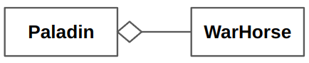

# OOP : Is-a and Has-a Relationship

OOP에서 설계 단계 중 가장 중요한 부분 중 하나가 object간의 관계를 정하는 것이다.  

사용할 수 있는 관계들 중 가장 유명한 것은 다음과 같은 2가지 이다.

* `is-a` relationship
* `has-a` relationship

## `is-a` relationship

보통 상속(inheritance)을 통해 생성되는 관계  
  
Human ← Warrior 라고 하면, Human이라는 super class를 상속받아 Warrior가 구현되고, Warrior is a Human 이 성립함 (역은 성립되지 않음.)

```python
class Human:
    def __init__(self, name):
        Human.ds_type = "Human"
        self.job = None
        self.name = name
        
    def introduce(self):
        print("------------------------")
        print(f"제 이름은 {self.name}입니다.")
        print(f"제 직업은 {self.job}입니다.")
        print(f"저의 종족은 {Human.ds_type}입니다.")
        
class Warrior (Human): # is-a relationship

    def __init__(self, name):
        super().__init__(name)
        self.job = "Warrior"

    def bash (self):
        print("강타 능력")
```

## `has-a` (= Embedded 이라고도 불림)

**보통 object의 member 혹은 attribute로 구성되는 관계** 를 가리킨다. 

* 한 object가 다른 object의 attribute로 속하게 되어 생성되는 관계임.
*  Composition Relation 과 Aggregation Relation 으로 나뉨.

다음은 Artificial Neural Network의 abstraction 인 class `MyANN`의 instance가 attribute로 `Model` class의 instance를 가지는 단순한 Python code임.

```python
class Model:
  def train(self):
    print('train!!')
  def predict(self):
    print('predict!')

class MyANN:
  def __init__(self, model):
    self.model = model
```

- 위의 경우, `MyANN`의 instance는 attribute로 `Model` type(or class)의 instance를 가지고 있음.
- 생성될 때, 가지고 있는 경우로 ***Composition Relation*** 이라고 불림. (`has-a` 관계에서 결합도가 높은 경우 ***composition relation*** 이라고 부르며, ^^두 object의 life cycle이 같은 경우가 일반적^^ 임.)
- Composition Relation과 달리 ^^life cycle이 다르고, 결합도가 떨어지는 경우^^ 의 `has-a` 관계는 ***Aggregation relation*** 이라고 함.



* Aggregation relation의 UML. 만일 사다리꼴이 색이 채워져 있을 경우엔 Composition Relation이 됨.

## Summary

- `Is-a` 관계와 `Has-a` 관계
    - `Is-a` 관계 : `A` 가 `B` 인 관계
        - 예) 사과는 과일이다.
    - `Has-a` 관계 : `A` 가 `B` 를 가지고(포함하고) 있는 관계
        - 예) 자동차는 타이어를 가지고 있다.
- 포함(embedded,`has-a`)과 상속(inheritance, `is-a`)을 구분해서 사용하기 위한 가이드라인
    - `Has-a` 관계의 경우에는 embedding을 사용한다.
    - `Is-a` 관계의 경우에는 inheritance을 사용한다.