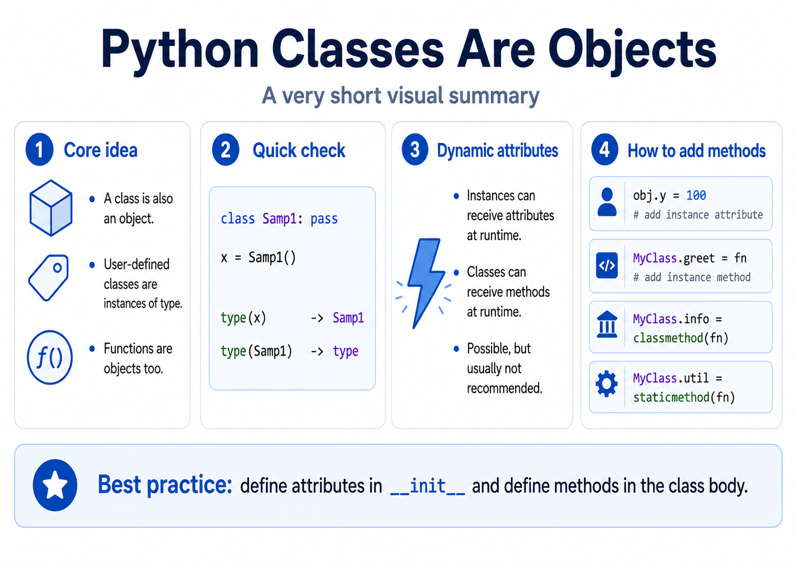

# Python에서의 Class

{style="display: block; margin: 0 auto; width: 600px"}

## Class도 Python에서는 object임

다음은 Python에서 class와 object의 실체를 잘 보여준다.

* Python에서 대부분의 class는 `object`를 최상위 base class로 가진다.
* Python에서 class 자체도 object이다.
* Python의 모든 class는 `type` class의 instance이다.


참고: [이에 대한 보다 자세한 자료](https://ds31x.tistory.com/573)

우리가 `Samp1`이라는 class를 정의하고, `a`라는 이름의 variable에 `Samp1`의 instance를 할당한 경우는 다음과 같다.

```python linenums="1"
class Samp1:
    pass

a = Samp1()
```

이 경우 `type()`을 이용하면 다음과 같은 결과를 얻을 수 있다.

```python linenums="1"
>>> type(a)
<class '__main__.Samp1'>
>>> type(Samp1)
<class 'type'>
```

즉, 다음과 같이 정리할 수 있다.

* `a`는 `__main__` module에 정의된 `Samp1` class의 instance이다.
* `Samp1` class는 `type` class의 instance이다.

Python에서는 class도 object이고, function도 object이다.

> Python에서 특히 function은 first-class object이다.
>
> 참고: [First-class Object](https://ds31x.tistory.com/43)

심지어 `int`, `float` 같은 built-in type도 object이다.

즉, Python에서는 class도, function도 variable에 할당할 수 있다.

> 재미있는 점은 `type`은 function이 아니라 callable object라는 것이다.
> `type`의 type을 확인해보면 다시 `type` class로 나온다.
>
> ```python
> type(type)
> # <class 'type'>
> ```
>
> 즉, 우리가 만든 custom class도 보통 `type`의 instance이고,
> `type` 자신도 `type`의 instance이다.
>
> 단, `type` class는 조금 특별해서, MRO를 확인하려면 다음과 같이 사용하는 것이 안전하다.
>
> ```python
> type.mro(type)
> ```
>
> `int`의 경우 `int.mro()`와 `type.mro(int)`를 모두 사용할 수 있는 것과 차이가 있다.

다음 코드를 수행해서 각 경우의 data type을 확인해보자.

```python linenums="1"
class Samp1:
    pass

def Func1():
    pass

a = Samp1()
b = Func1

c = 7

print(f"a's type: {type(a)}")         # a's type: <class '__main__.Samp1'>
print(f"Samp1's type: {type(Samp1)}") # Samp1's type: <class 'type'>

print(f"Func1's type: {type(Func1)}") # Func1's type: <class 'function'>
print(f"b's type: {type(b)}")         # b's type: <class 'function'>

print(f"Literal 7's type: {type(7)}") # Literal 7's type: <class 'int'>
print(f"c's type: {type(c)}")         # c's type: <class 'int'>
print(f"int's type: {type(int)}")     # int's type: <class 'type'>
```

> `literal`은 데이터 값 자체를 나타내는 표현을 가리킨다.
>
> 참고: [literal에 대한 자세한 참고 자료](https://dsaint31.tistory.com/462)

---

## 동적으로 class에 attribute 추가 및 제거하기

Python에서는 class도 object이므로 class에도 attribute를 동적으로 추가할 수 있다.

또한 Python은 dynamic language이므로, 

* 이름에 어떤 값을 binding하는 시점에 해당 이름이 만들어진다.
* 즉, 미리 변수형과 이름을 선언한 뒤 값을 할당하는 방식이 아니다.

이 특성 때문에 **class와 instance에 attribute를 동적으로 추가하거나 제거할 수 있다.**

> 하지만 권하지 않는다.
> 이런 방식을 많이 사용하면 code의 구조를 추적하기 어려워지고, debugging도 어려워진다.

다음 코드는 동적으로 instance와 class에 attribute를 추가하는 예제이다.

`del`을 사용하면 동적으로 제거할 수도 있다.

```python linenums="1"
import types

class MyClass:
    def __init__(self, x):
        self.x = x

def greet(self):
    print(f"Hello, {self.x}")

# ================
# instance variable 또는 instance attribute를 동적으로 추가.
obj0 = MyClass("dynamic_attri")
obj0.y = 100
print(f"{obj0.y = }")

del obj0.y

# ================
# Special Case
# 특정 instance에만 instance method를 추가.
obj = MyClass("test")
obj.greet = types.MethodType(greet, obj)
# greet는 obj에 binding된 bound method가 되며, obj에서만 사용 가능.

obj.greet()
del obj.greet

# n_obj = MyClass("new")
# n_obj.greet()  # error! greet는 obj에만 추가되었으므로 n_obj에서는 사용할 수 없음.

# ================
# instance method를 class에 동적으로 추가.
MyClass.greet1 = greet

obj1 = MyClass("obj1")
obj1.greet1()
obj.greet1()

# ================
# class method를 class에 동적으로 추가.
def desc(cls):
    print(f"This is {cls.__name__}")

MyClass.desc = classmethod(desc)

MyClass.desc()
obj.desc()

# ================
# static method를 class에 동적으로 추가.
def copyright():
    print("GPL!")

MyClass.copyright = staticmethod(copyright)

MyClass.copyright()
obj.copyright()
```

위 예제에서 가장 중요한 부분은 다음이다.

```python
MyClass.greet1 = greet
```

class에 instance method를 동적으로 추가하려면 

* `function object`를 그대로 class attribute로 대입해야 한다.
* 그러면 instance를 통해 접근할 때
* descriptor protocol에 의해 해당 instance가 첫 번째 인자 `self`로 자동 binding된다.

반면, 특정 instance 하나에만 method를 추가하려면 다음처럼 `types.MethodType()`을 사용한다.

```python
obj.greet = types.MethodType(greet, obj)
```

* 이 경우 `greet`는 `obj`에 binding된 bound method가 되며, `obj`에서만 사용할 수 있다.

class method와 static method는 각각 다음처럼 descriptor로 감싸서 class attribute로 저장한다.

```python
MyClass.desc = classmethod(desc)
MyClass.copyright = staticmethod(copyright)
```

정리하면 다음과 같다.

* instance attribute 추가: `obj.attr = value`
* 특정 instance에만 method 추가: `obj.method = types.MethodType(function, obj)`
* class 전체에 instance method 추가: `ClassName.method = function`
* class method 추가: `ClassName.method = classmethod(function)`
* static method 추가: `ClassName.method = staticmethod(function)`

> 절대로 필요한 경우가 아니라면
> 동적으로 attribute를 추가하거나 삭제하는 것은 권하지 않는다.

일반적으로 모든 instance attribute는 가급적 `__init__(self, ...)`에서 명시적으로 할당해두는 것이 좋다.

class에 필요한 method 역시 class body 안에 명시적으로 정의하는 것이 좋다.

다음을 참고:

* [Python에서 custom class 만들기](https://ds31x.tistory.com/240)

