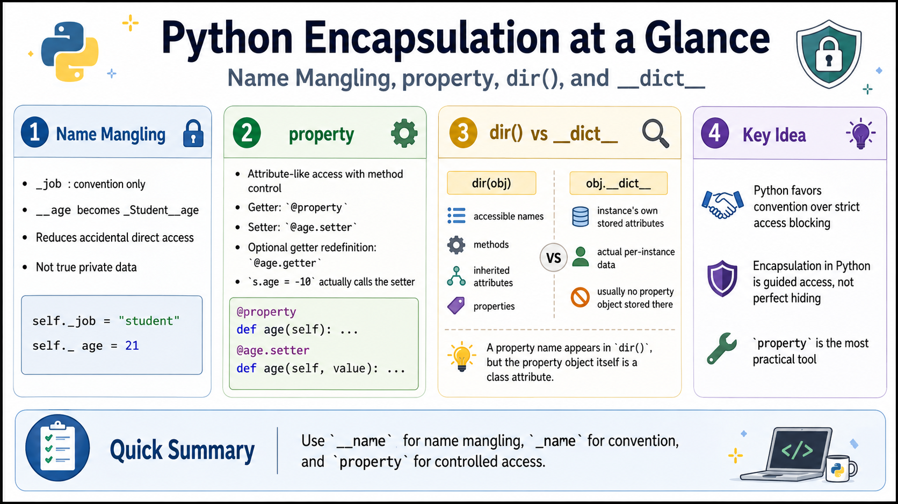

# Python에서의 Encapsulation 관련 구현

{style="display: block; margin: 0 auto; width: 600px"}

## Data Hiding 관점

Encapsulation을 엄격히 적용하려면,

* data에 직접 접근하지 않고
* getter나 setter와 같은 method를 통해서만 접근하도록 해야 한다.

문제는 Python에서는 이를 강제하기 쉽지 않다는 점이다. 이를 위해 Python에서 지원하는 대표적인 기법이 `Name mangling`이다.

다음 코드를 살펴보자.

```python
class Student:
    def __init__(self, name, age):
        self.name = name
        self.__age = age      # Name mangling
        self._job = "test"    # 관례적으로 외부에서 직접 접근하지 말 것을 _로 표시

    def set_name(self, name):
        self.name = name

    def set_age(self, age):
        self.__age = age

    def set_job(self, job):
        self._job = job       # 관례상 _가 앞에 있으면 직접 접근하지 말라는 의미

    def display(self):
        print(f"{self.name}'s age is {self.__age}")
        print(f"{self.name}'s job is {self._job}")


if __name__ == "__main__":
    s = Student("김 아무개", 21)

    s.name = "박 아무개"
    s._job = "학생"  # 관례일 뿐이므로 강제력은 약함. 실제 접근 가능.

    s.display()
    print(dir(s))
    # print(s.__dict__)  # instance attribute들을 출력해줌.
```

* `__age`처럼 attribute 이름 앞에 `__`를 붙이면, Python은 data hiding을 위해 실제 이름을 `_Student__age`로 변경하여 관리한다.
* 이를 `Name mangling`이라고 한다.
* class 내부에서는 `self.__age`를 사용하여 접근할 수 있다.
* 하지만 class 외부에서 `s.__age`처럼 접근하면 기존의 `__age`에 접근하는 것이 아니다.
* 위 코드에서 `s.__age = 32`를 실행해도 에러는 발생하지 않는다.
    * 하지만 기존의 `_Student__age`가 변경되는 것이 아니다.
    * 새로운 `__age`라는 instance attribute가 추가되고, 거기에 `32`가 저장된다.
* 반대로 `print(s.__age)`처럼 값에 접근하려고 하면 `AttributeError`가 발생할 수 있다.
    * 실제 attribute 이름은 `_Student__age`이기 때문이다.
    * 즉, `s._Student__age`는 존재하지만 `s.__age`는 원래 존재하지 않는다.

> 외부에서의 직접적인 접근을 막기 위해 도입된 방식이지만,  
> 어떤 의미에서는 완전한 data hiding이라고 보기는 어렵다.  
> 개발자가 마음먹고 접근하려면 `_Student__age`라는 이름을 통해 접근할 수 있기 때문이다.

이 방식의 한계는 명확하다. Python에서는 일반적으로 각 object의 attribute들이 `__dict__`를 통해 관리되기 때문이다.

> `__dict__`는 해당 object의 attribute들을 dictionary 형태로 가지고 있다.  
> 즉, `__dict__`를 통한 직접 접근과 변경이 가능하다.  
> 이 때문에 Python에서는 Java나 C++처럼 엄격한 의미의 encapsulation을 강제하기 어렵다.

---

## property 설정

`property`를 이용하면 encapsulation의 장점을 살리면서도, 외부에서는 직접 attribute에 접근하는 것처럼 간단하게 사용할 수 있다.

다음 예제에서 `property`를 사용한 부분을 참고하라.

```python
class Student:
    def __init__(self, name, age):
        self.__name = name
        self.__age = age      # Name mangling

    def get_name(self):
        return self.__name

    def set_name(self, name):
        self.__name = name

    # property object를 이용한 구현
    name = property(get_name, set_name)

    # Decorator를 이용한 구현
    @property
    def age(self):
        return f"[{self.__age}]"

    @age.setter
    def age(self, age):
        if age < 0:
            self.__age = 0
        else:
            self.__age = age

    def display(self):
        print(f"{self.__name}'s age is {self.__age}")


if __name__ == "__main__":
    s = Student("김 아무개", 21)

    s.name = "박 아무개"
    s.age = -10

    print(s.age)

    print("------------")
    s.display()

    print("------------")
    print(s.__dict__)  # instance attribute 확인

    print("------------")
    print(dir(s))      # 접근 가능한 attribute 이름 확인
```

* `s.age = -10`은 직접 attribute에 값을 대입하는 것처럼 보인다.
* 하지만 실제로는 `@age.setter`가 붙은 method가 호출된다.
* 따라서 값 검증, 값 변환, 예외 처리 등을 setter 내부에서 처리할 수 있다.
* 재사용이 빈번한 class에서는 `property`를 사용하는 방식이 권장된다.
* `name`은 `property()` 함수를 직접 사용하여 구현하였다.
* `age`는 `@property`와 `@age.setter` decorator를 사용하여 구현하였다.
* `@property`는 getter를 처음 정의할 때 사용하며, 기존 getter를 다시 정의해야 하는 경우에는 `@age.getter`도 사용할 수 있다.
* `property`는 class attribute로 등록된다.
    * 따라서 instance의 `__dict__`에는 `property` object 자체가 보이지 않는다.
    * 대신 `dir(s)`를 통해 `name`, `age`와 같은 property 이름을 확인할 수 있다.

---

## `dir()`와 `__dict__`의 차이

`dir()`와 `__dict__`는 모두 object의 attribute를 확인할 때 사용되지만, 의미가 다르다.

* `dir(obj)`
    * 해당 object에서 접근 가능한 attribute 이름들을 list로 반환한다.
    * instance attribute뿐 아니라 class attribute, method, inherited attribute, special method까지 포함될 수 있다.
* `obj.__dict__`
    * 해당 object가 직접 가지고 있는 instance attribute들을 dictionary로 반환한다.
    * 보통 instance 내부에 실제로 저장된 data attribute를 확인할 때 사용한다.

즉, `dir()`는 “이 object에서 어떤 이름으로 접근 가능한가”를 확인하는 용도이고, `__dict__`는 “이 instance가 실제로 어떤 attribute를 저장하고 있는가”를 확인하는 용도임.

```python
s = Student("김 아무개", 21)

print(dir(s))       # 접근 가능한 attribute 이름 전체 확인
print(s.__dict__)   # instance가 직접 저장 중인 attribute 확인
```

예를 들어 `property`는 class attribute로 등록되므로 `dir(s)`에서는 확인되지만, instance의 `__dict__`에는 `property` object 자체가 저장되지 않는다.

---

## 정리

Python에서 encapsulation은 강제적인 접근 제한이라기보다는 약속과 우회적 장치에 가깝다.

* `_job`
    * 관례상 protected처럼 취급한다.
    * 외부에서 직접 접근하지 말라는 의미를 전달할 뿐, 접근을 막지는 않는다.
* `__age`
    * Name mangling이 적용된다.
    * 실제 이름이 `_Student__age`처럼 바뀐다.
    * 외부에서 실수로 접근하거나 덮어쓰는 것을 어느 정도 방지할 수 있다.
* `property`
    * 외부에서는 attribute처럼 사용하게 하면서
    * 내부적으로는 getter/setter method를 호출하게 할 수 있다.
* `dir()`와 `__dict__`
    * `dir()`는 접근 가능한 attribute 이름들을 확인할 때 사용한다.
    * `__dict__`는 instance가 실제로 저장한 attribute들을 확인할 때 사용한다.

즉, Python의 encapsulation은 “완전한 차단”이 아니라 “직접 접근을 피하도록 유도하고, 필요한 경우 getter/setter 로직을 끼워 넣는 방식”에 가깝다.

---

## References

* GeeksforGeeks, [Name mangling in Python](https://www.geeksforgeeks.org/name-mangling-in-python/)
